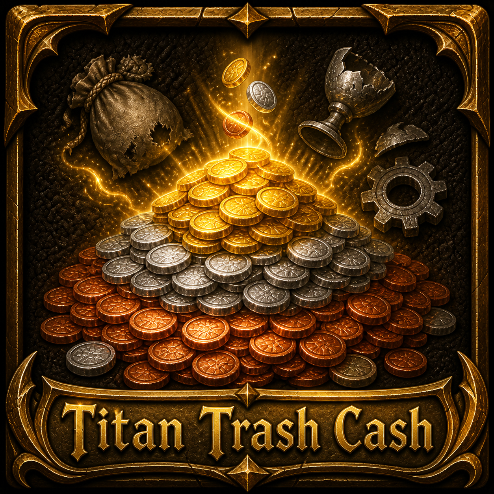

# Titan Panel [Trash Cash]

  

**Titan Panel [Trash Cash]** is a plugin for **Titan Panel** that displays the total vendor value of trash items in your bags.

See at a glance how much gold you can earn by selling grey-quality items, without opening your bags or visiting a vendor.

## Features

- Display the total vendor value of trash items in your bags directly in the Titan Panel bar
- Show the number of trash items in the Titan Panel tooltip
- Update the displayed value as the contents of your bags change

## How to Use

1. Install **Titan Panel** and **Titan Panel [Trash Cash]**.
2. Log in to the game.
3. The total vendor value of grey-quality items in your bags will be displayed automatically in the Titan Panel bar.
4. Hover over the Titan Panel entry to see the number of trash items currently in your bags.

## Bug Reports and Feature Requests

Please use the [CurseForge issue tracker](https://wow.curseforge.com/projects/titan-panel-trash-cash/issues) to report bugs or request features.

## Support

If you would like to support the development of Titan Panel [Trash Cash], you can do so on [Patreon](https://www.patreon.com/c/keldor).
